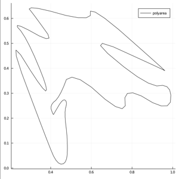
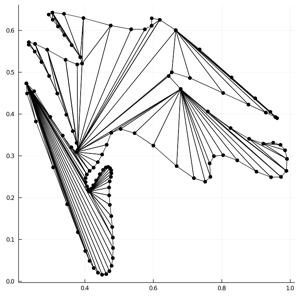

# Discretization

```@docs
discretize
DiscretizationMethod
FIST
```
# FIST  
Examples for the FIST algorithm. 
  
## Usage  
  
```julia
poly = readpoly(Float32, joinpath(datadir, "smooth1.line"))
mesh = discretize(poly, FIST())
```  
  
#### Flow:
In the above example, first we read the values from the file `smooth1.line`.  
Next, we construct a polygon from these values, and store the result in the variable `poly`.  
Upon plotting `poly`, we get the following:  
  
  
    
      
Next, we discretize the above polygon into Triangles using the FIST algorithm and store the result in the variable `mesh`.  
Upon plotting `mesh`, we get the following:  
  
    


